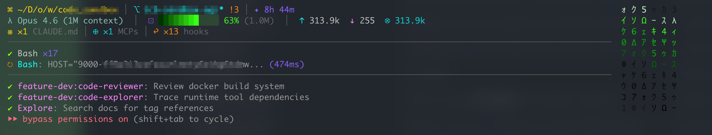

<p align="center">
  
</p>

<h1 align="center">cc-shannon-statusline</h1>

<p align="center">
  Live ANSI HUD for <a href="https://claude.ai/code">Claude Code</a> with project, model, context, throughput, tool, agent, and configuration state.
</p>

<p align="center">
  <a href="https://www.npmjs.com/package/cc-shannon-statusline"></a>
  <a href="./LICENSE"></a>
  <a href="./package.json"></a>
</p>

## Install

```bash
npm install -g cc-shannon-statusline
```

Add to `~/.claude/settings.json`:

```json
{
  "statusLine": {
    "type": "command",
    "command": "cc-shannon-statusline",
    "refreshInterval": 1
  }
}
```

`refreshInterval` is measured in seconds. `1` refreshes the statusline at least once per second in addition to Claude Code events.

## HUD

Cyberpunk mode renders below each Claude Code response:

```text
⌘ ~/D/project  │  ⎇ main* ↑2 !3 +1  │  ✦ 12m  │  ⊟ auto
λ Opus · claude-opus-4-6  │  ⊡ ████████░░░░ 65% (200k)  │  ↑ 36k  ↓ 300  ⊗ 8.5k
» TTFT 1.24s  │  Decode ~62.4 tok/s · ~312 tok
※ ×3 CLAUDE.md  │  ⊕ ×4 MCPs  │  ↩ ×12 hooks  │  ★ ×5 Skills
──────────────────────────────────────────────────────
✔ Read ×12  │  ✔ Edit ×7  │  ✔ Bash ×4
↻ Bash: ~/D/project/src (3s)
```

When `model.display_name` and `model.id` differ, both are shown. The ID reflects the active model variant.

## Configuration

Optional file: `~/.shannon/cc-shannon-statusline/config.json`

```json
{
  "rain": true,
  "throughput": true
}
```

| Option | Type | Default | Effect |
|---|---|---:|---|
| `rain` | boolean | `true` | Show the matrix column in cyberpunk mode. |
| `throughput` | boolean | `true` | Show response metrics on line 3. |

Invalid or missing values use the defaults. Powerline mode is single-line and uses `·` separators:

```json
{
  "statusLine": {
    "type": "command",
    "command": "cc-shannon-statusline --style powerline",
    "refreshInterval": 1
  }
}
```

`throughput: false` also hides the throughput segment in powerline mode.

## Metrics

- `TTFT`: transcript-observed time from the preceding user/tool event to the first assistant event.
- `Decode`: transcript-observed output rate; `~` marks an estimate.

## Bridge

When a local consumer is listening, each invocation writes session data as NDJSON to `/tmp/shannon-<uid>.sock`.

## Development

```bash
bun install
bun test
bun run build
bun run test:stdin
```

See [CONTRIBUTING.md](./CONTRIBUTING.md) and [RELEASING.md](./RELEASING.md).

Runtime requirement: Node.js `>= 22`.

## License

MIT
